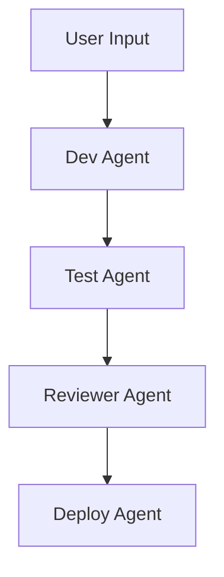

# Chapter 11: AI Agents

## 🤖 What Are AI Agents?

AI agents are autonomous systems that:

- Perceive tasks or goals
- Plan how to complete them
- Take action by calling tools or writing code
- Learn or adapt based on feedback

They are different from LLMs that simply respond to prompts. Agents **decide** what to do next and **act**.

---

## 🧠 Examples of AI Agent Use Cases

| Agent Name   | Role                       | Tech Used             |
|--------------|----------------------------|------------------------|
| DevBot       | Writes & tests code        | GPT + GitHub API      |
| InfraOps     | Manages cloud infra        | CrewAI + Terraform     |
| BugFixer     | Detects & patches bugs     | AutoGen + PyTest       |
| PR Reviewer  | Reviews & merges PRs       | LangGraph + GitHub     |
| UI Generator | Builds UIs from sketches   | GPT-4 + Tailwind       |

---

## 🔁 Agent Frameworks to Know

| Framework     | Description                                        |
|----------------|----------------------------------------------------|
| [LangChain](https://www.langchain.com/)  | Build chains of LLM tools with memory and routing |
| [AutoGen](https://github.com/microsoft/autogen)     | Multi-agent collaboration from Microsoft           |
| [CrewAI](https://github.com/joaomdmoura/crewai)     | Human-like agents with roles and collaboration     |
| [LangGraph](https://github.com/langchain-ai/langgraph) | Graph-based agent workflows using LangChain        |

Prompt:

> Create a CrewAI team with a DeveloperAgent and a ReviewerAgent for building a login form in React.

---

## 🛠️ Agent Capabilities in Fullstack Dev

- 🔍 Research APIs or documentation
- 🧑‍💻 Generate and improve code
- 🧪 Write and run tests
- 🚀 Deploy apps to platforms
- 🧩 Chain tools (e.g., run shell, git, curl)

Prompt:

> Build an AutoGen agent that receives a bug report and patches the corresponding Python function.

---

## 🧪 Example: AutoGen Agent that Writes Unit Tests

```python
from autogen import AssistantAgent, UserProxyAgent

assistant = AssistantAgent(name="TestWriter")

user_proxy = UserProxyAgent(name="You")

user_proxy.initiate_chat(
  assistant,
  message="Write pytest unit tests for a function that calculates loan interest over time."
)
```

Prompt:

> Use AutoGen to simulate a conversation between a user and a test-generating agent for my backend.

---

## 🧰 CrewAI Developer Agent Setup (Example)

```python
from crewai import Crew, Agent, Task
from langchain.tools import ShellTool

dev = Agent(
    role='Developer',
    goal='Write and commit a FastAPI endpoint for user registration',
    backstory='You are a backend engineer with API expertise.',
    tools=[ShellTool()]
)

task = Task(
    description="Create a POST /register endpoint that hashes passwords and saves user data.",
    agent=dev
)

crew = Crew(agents=[dev], tasks=[task])
crew.kickoff()
```

Prompt:

> Define a CrewAI agent that sets up a new FastAPI project and pushes to GitHub.

---

## ⚙️ Dev Workflow with Agents

```
🧠 Idea
 ↓
📝 Agent writes spec
 ↓
👩‍💻 Dev Agent writes code
 ↓
🧪 Test Agent tests code
 ↓
🚀 Deploy Agent launches it
 ↓
🔁 Feedback loop improves system
```

Prompt:

> Create a multi-agent workflow where one agent writes a React form, and another tests it.

---

## 📊 Visualization: Agent Workflow with LangGraph



Prompt:

> Show a LangGraph diagram of an AI agent team building a fullstack feature.

---

## 🧠 Tips for Building Reliable Agents

- ✅ Give each agent a clear **role**
- ✅ Limit scope per task (atomic goals)
- ✅ Add memory or history tracking
- ✅ Use tool integrations (e.g., shell, git, web)
- ✅ Review output for hallucinations

Prompt:

> Create a CrewAI agent that monitors GitHub PRs, runs tests, and comments with suggestions.

---

## 🧭 Up Next: Chapter 12 – Putting It All Together

Combine:

- Prompts
- Agents
- Fullstack skills
- Deployment

…into a real project built by and for AI-enhanced developers.

> 📂 File: [`12-project-blueprint.md`](./12-project-blueprint.md)
